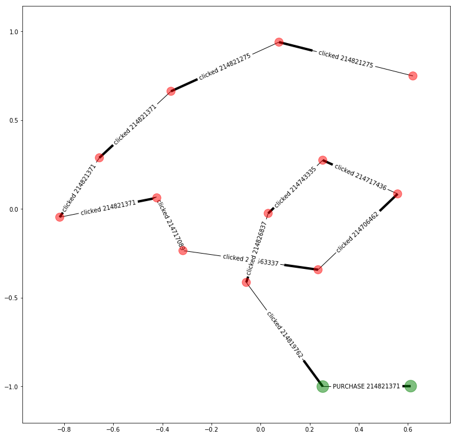
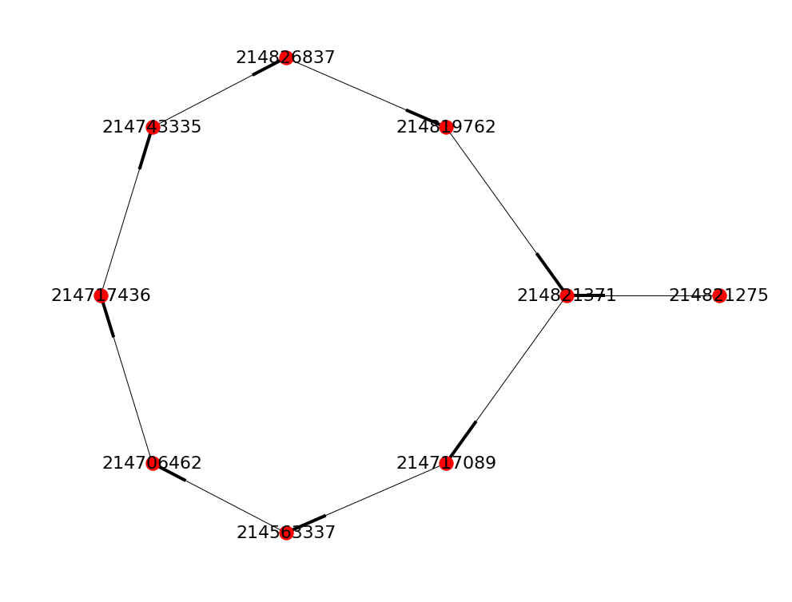
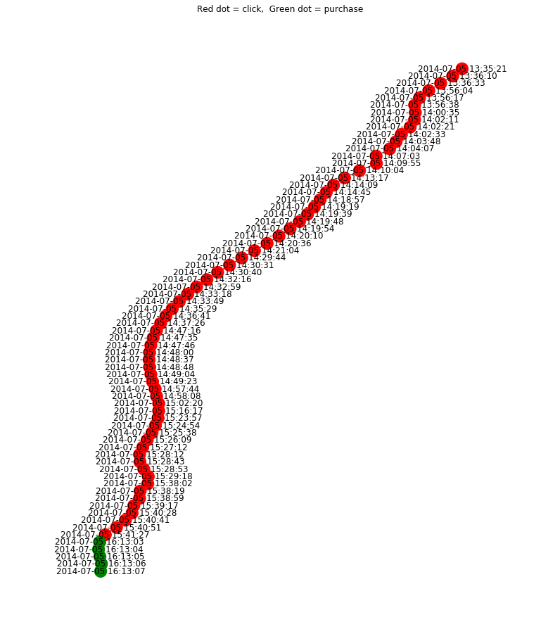
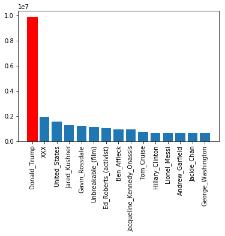
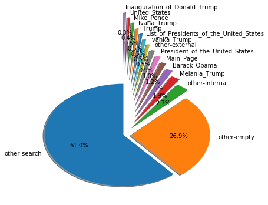
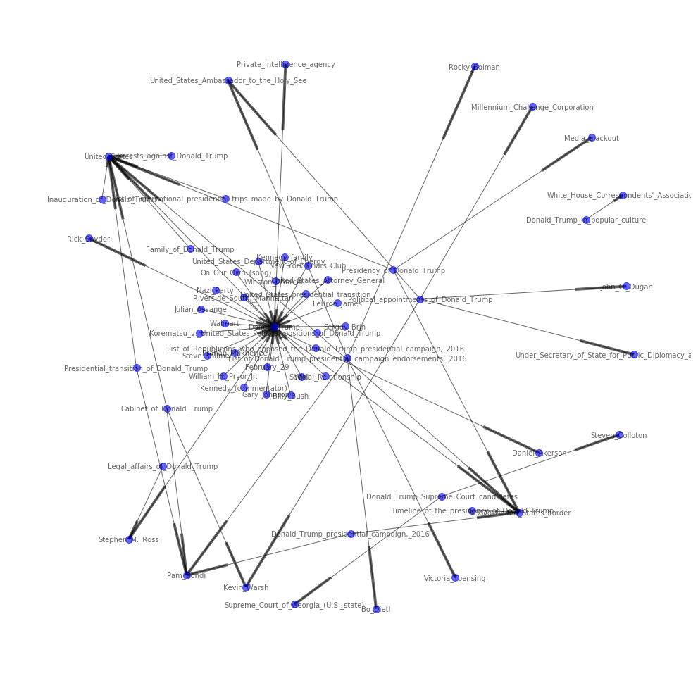

# Click path / clickstream

This tutorial is about click paths (also known as clickstream). A Click path is the sequence of clicks on a web site made by a visitor.

This tutorial consists of two notebooks: 
* The [clickpath -notebook](clickpath.ipynb) deals with click path data from Yoochoose GmbH and consists of sequences of clicks per sessions by different users in an
e-commerce web site and also a dataset consisting of purchases made by users.

* The [clickstream -notebook](clickstream.ipynb) is about Wikipedia Clickstream, which has a dataset containing referer/resource pairs from Wikipedia logs.  A referer is 
a page from which a visitor came to the resource. The data shows the path to Wikipedia and what links get clicked.

---

### Click path of Yoochoose GmbH

The yoochoose-buys.dat includes the purchases made (some are 0), session numbers, timestamps, IDs of the items bought and prices. Yoochoose-clicks.dat contains clicks by 
session, timestamps and item IDs.

These are the first rows of *times* dataframe, which is *buys* and *clicks* concatenated and has *time* parsed out from *timestamp*:


```markdown
itemID 	    price 	    quantity 	    session 	    timestamp 	    time

1150753 	214536502 	NaN 	NaN 	1 	2014-04-07T10:51:09.277Z 	2014-04-07 10:51:09
1150754 	214536500 	NaN 	NaN 	1 	2014-04-07T10:54:09.868Z 	2014-04-07 10:54:09
1150755 	214536506 	NaN 	NaN 	1 	2014-04-07T10:54:46.998Z 	2014-04-07 10:54:46
1150756 	214577561 	NaN 	NaN 	1 	2014-04-07T10:57:00.306Z 	2014-04-07 10:57:00
1150760 	214757390 	NaN 	NaN 	2 	2014-04-07T13:59:50.710Z 	2014-04-07 13:59:50

```


*Session* dataframe, which shows the calculated duration of sessions, purchase count, and clicks. Grouped by sessions.


```
        time_spent  purchase_count  clicks_in_session  time_spent_sec
session                                                              
5638441   00:14:28               0                  4             868
5638442   00:02:21               0                  3             141
5638443   00:03:45               0                  4             225
5638444   02:37:46             144                209            9466
```

---

Average time spent on site (seconds):  

*404.8591217104847*


Average time of sessions that lead to purchase:  

*1288.5981526243095*


Average time of sessions that did not lead to purchase:  

*353.32175919701905*


Correlation of time spent and number of clicks and purchases:
```
                   purchase_count  clicks_in_session  time_spent_sec
purchase_count           1.000000           0.435151        0.260072
clicks_in_session        0.435151           1.000000        0.558194
time_spent_sec           0.260072           0.558194        1.000000
```

---



This NetworkX MultiDiGraph visualises a click path. The thicker head of line is the head of an arrow, marking the direction. 
Red dots are clicks, green dots are purchases.




We can also visualise a click path with a spectral graph, in which we can more clearly see that this particular visitor started with item 214821275, was then looking at item 214821371, and then later came back to buy it.




This "kamada kawai" graph visualises clicks of one visitor. RED means clicking an item, GREEN means a purchase.

---

[Read full tutorial: clickpath -notebook](clickpath.ipynb) 

---


### Wikipedia Clickstream


The data consists of 'prev' (where visitor came from), 'curr' (to this article), 'type' of link, and number 
of 'prev'/'curr' pair occurrances:

```
                        prev                           curr      type   n
1048570       other-internal  The_Deadly_Mantis_(1978_film)  external  17
1048571           Gordon_Liu  The_Deadly_Mantis_(1978_film)      link  44
1048572  2002_UEFA_Cup_Final                  Ferry_de_Haan      link  16
1048573         other-search                  Ferry_de_Haan  external  22
1048574          other-empty                  Ferry_de_Haan  external  30
``` 


Top 10 articles of Wikipedia 2017



Where did visitors come from to the most read article of Wikipedia in 2017




Let's visualise the articles related to the number one article of Wikipedia with networkx MultiDiGraph,
which shows the direction of clicks from an article to another.




[Read full tutorial: clickstream -notebook](clickstream.ipynb) 


---

> keywords: networkx, pandas basics, file manipulation, visualising