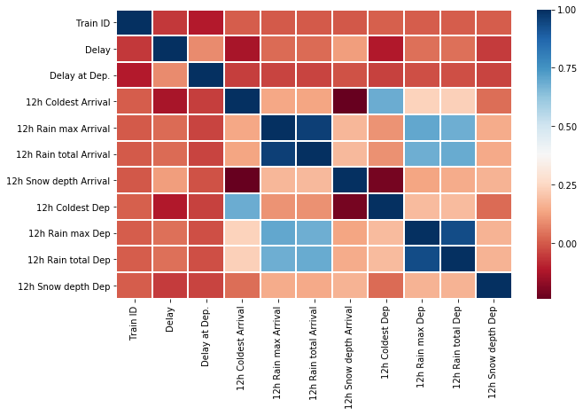
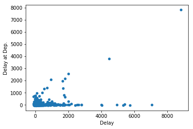
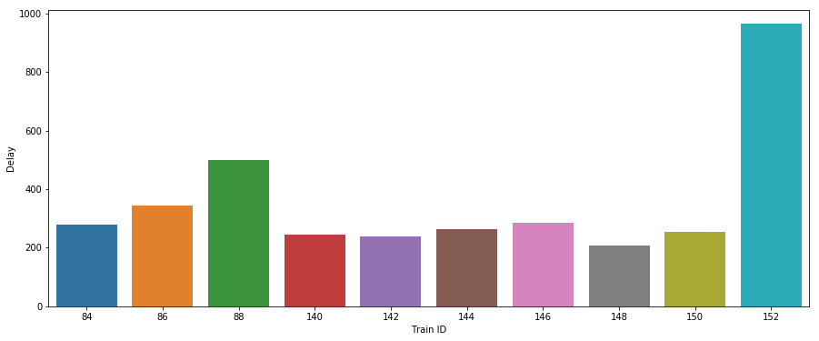
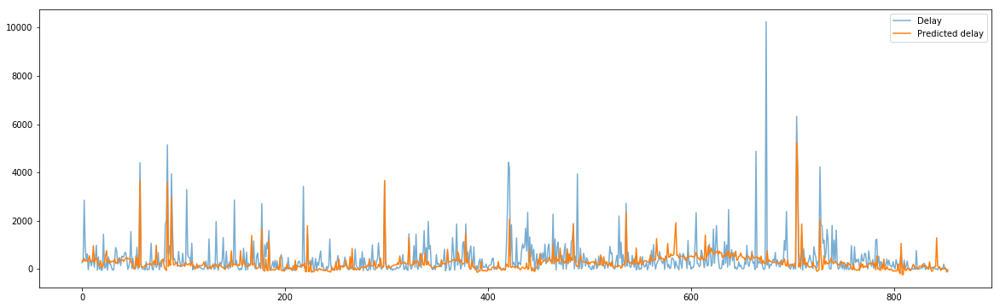
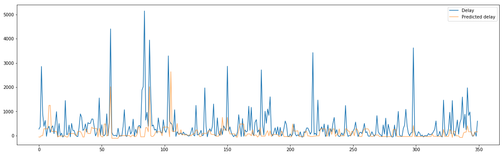
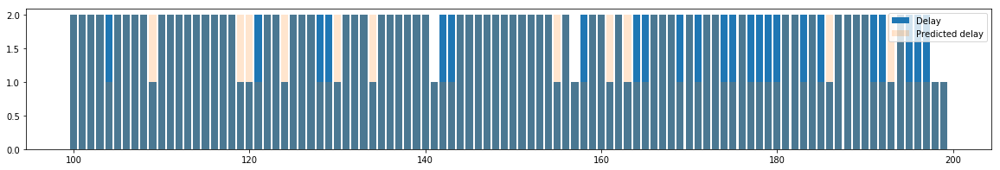
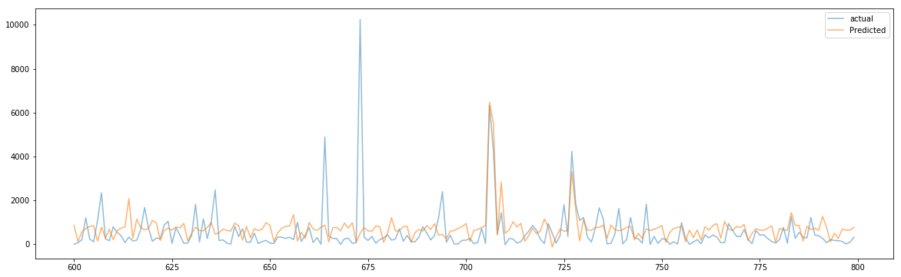
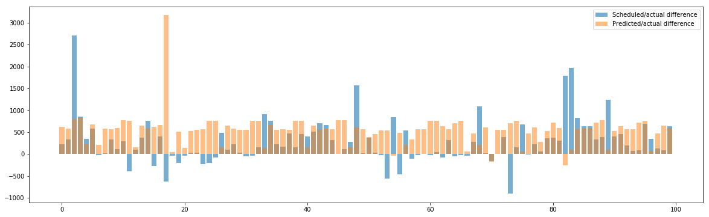
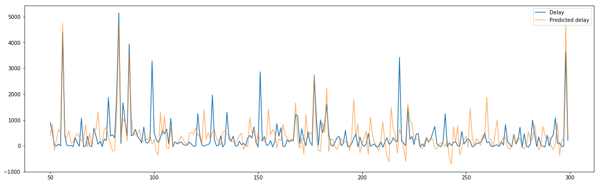

# Correlation of trains' schedule and weather conditions

--- 

# Collecting data

### Requesting train traffic from Digitraffic.fi

>[https://rata.digitraffic.fi-interface. License CC BY 4.0](https://rata.digitraffic.fi-interface. License CC BY 4.0)

In the _[traffic-weather](traffic-weather.ipynb)_ notebook, railway traffic data from digitraffic.fi is requested using the "requests" library.

The data is in JSON format, and it is parsed using the "json"libary. A train's category, type (arrival/
departure), scheduled time and actual measured time is fetched from json as well as the stations on the route.
Thus, a train's possible delay can be calculated. All trains on a certain route on a particular date can also be
requested.

### Requesting Weather data from the Finnish Meteorological Insititute (in XML)

>[https://en.ilmatieteenlaitos.fi/open-data](https://en.ilmatieteenlaitos.fi/open-data) (MIT license)

The weather data is fetched from XML through an API key and parsed using the Minidom library. 
Temperature, the amount of rain within 1 hour and snow depth can be fetched from a selected measuring
position on a desired timestamp.

### Combining the data

[In the tutorial](traffic-weather.ipynb), railway data is collected from a certain period of time,
and on a certain route. Then weather data is collected for the same period from departure and arrival 
stations. After this, the weather data is combined to trains' data, calculating the coldest temperature, 
the amount of rain, and the highest snow depth within 12h from the departure and within 12h from the arrival of each train.

Finally, the combined dataframe is saved to a CSV file.

---

# Examining correlation

In the _[traffic-weather-correlation](traffic-weather-correlation.ipynb)_ notebook, the previously saved
CSV is loaded to a dataframe and the Seaborn library is used to visualize the correlation:

Delay at the departure has a small correlation with delay at arrival. Cold weather has small negative correlation with delays. 
Temperature drops -> delays increase.  Snow depth at arrival station seems to have positive correlation. Amount of snow increases -> delays increase.

---

In some cases, the delay at departure naturally correlates with the delay at arrival but not always.

---

Mean of delays, grouped by train numbers.

---

# Predicting schedules

> The predictions were made in two different starting points: _[Predicting delays](traffic-weather-predictions.ipynb)_ and _[Predicting trip duration](traffic-weather-prediction-triptime.ipynb)_ .

In the _[traffic-weather-predictions](traffic-weather-predictions.ipynb)_ notebook, the combined weather/railway data
is used to predict possible delays in trains' arrivals. The dataframe is first scaled with sklearn's MinMaxScaler, and then
multilayer perceptron is used for prediction:

 There are some big delays that could not be predicted, such as index 674, however, those that could be predicted
 were actually already late at departure.

When the column with data of delayed departures is left out, the predicting does not really work, meaning that the affects of weather are quite small.

Prediction with KNN does not work as well as with perceptron:

---

# Classification

Next, in the _[traffic-weather-predictions](traffic-weather-predictions.ipynb)_ notebook, the delays are converted to just 0 and 1, 0 as early arrival and 1 as late.

Then three different classifiers are applied. KNN seems to be working most accurately in this case. Naive Bayes is just being pessimistic: nearly all trains are late...

> K-nearest neighbour classifier

In KNN classifier, the data is scaled between -1 and 1. Random forest and Naive bayes use regular values.

---

# Predicting trip time instead of delays

In _[traffic-weather-prediction-triptime](traffic-weather-prediction-triptime.ipynb)_ notebook, the duration of trip is predicted instead of predicting the delays. Then the predicted
duration is compared to the scheduled duration. The durations were calculated from scheduled times and actual timestamps.

Prediction was made using multi-layer perceptron, then the known delay at departure was added to the predicted duration, so that actual arrival and predicted arrival can be compared.

---

This chart shows actual trip duration and predicted trip duration in comparison to scheduled duration.

---

This chart shows predictions made with KNN regressor. It is possibly better than predicting delays with KNN, although with more variation.

---

### Predicting the "Delay at departure - Delay at arrival" -difference

In _[traffic-weather-prediction-diff](traffic-weather-prediction-diff.ipynb)_ notebook, predictions are calculated just like in the first prediction, however, this time 
the delay is converted to difference of "Delay" - "Delay at Dep."  when "Delay at Dep." is added to the prediction result of arrival station.

---

> keywords: JSON, XML, KNN, MLP, normalizing, MinMaxScaler