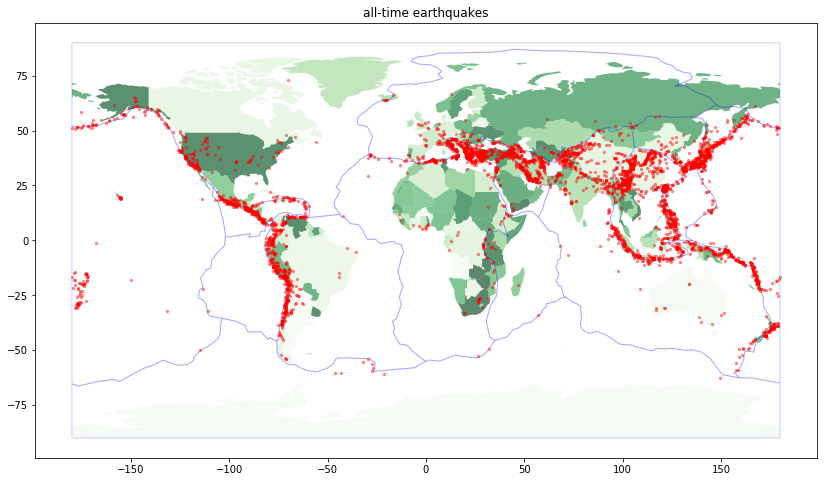
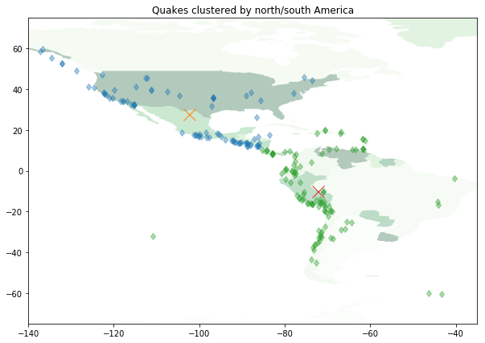
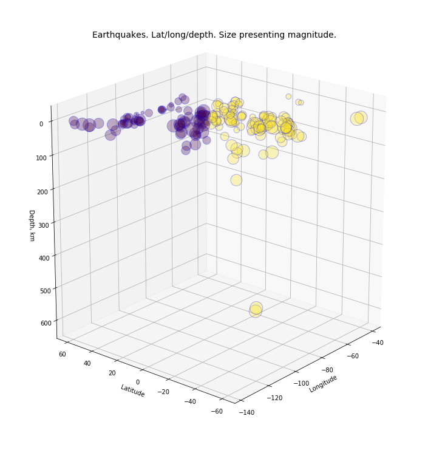

# Clustering earthquake data

### The worldmap
---

This notebook uses earthquake data from [NOAA (National oceanic and atmospheric administration)](https://www.ngdc.noaa.gov/).
The file from NOAA's [Significant Earthquake Database](https://www.ngdc.noaa.gov/nndc/struts/form?t=101650&s=1&d=1) 
includes all significant earthquakes since 2150 BC. 


At first, the latest 'signif.txt' -file is downloaded through `urllib`'s urlretrieve:
```
        import urllib.request # python 3+
        file = urllib.request.urlretrieve (urli, outputti)
```

The first line of the file is set as column labels:

```
    # read the first line, parse to column labels
    with open(outputti, 'r') as f:
        columns = f.readline().split("\t")
    
    # read earthquakes to dataframe
    qbc = pd.read_csv(outputti, sep="\t", header=None, names=columns)
```

Then, all unessential rows and columns, and rows with NaN values, are dropped. The remaining columns are converted from strings to floats.  
EQ_PRIMARY = magnitude.

```
    # select columns
    columns = ['YEAR', 'FOCAL_DEPTH', 'EQ_PRIMARY', 'LATITUDE', 'LONGITUDE']
    qbc = pd.DataFrame(qbc, columns=columns)

    # there are some empty strings, replace with none -> then drop
    qbc['LATITUDE'].replace('       ', np.nan, inplace=True)

    # drop rows with nan values from selected columns
    qbc.dropna(subset = ['EQ_PRIMARY', 'LONGITUDE', 'LATITUDE'], inplace=True)
    
    # convert strings to float (and int)
    qbc.loc[:,['EQ_PRIMARY','LATITUDE', 'LONGITUDE']] = qbc.loc[:,['EQ_PRIMARY','LATITUDE', 'LONGITUDE']].astype('float')
    qbc['YEAR'] = qbc['YEAR'].apply(int)

```



The worldmap is visualised through `geopandas`, and tectonic plates shapes from 
[http://legacy.jefferson.kctcs.edu/techcenter/gis%20data/World/Earthquakes/](http://legacy.jefferson.kctcs.edu/techcenter/gis%20data/World/Earthquakes/)
are added to the map. 


### Limit examination area to Americas, and cluster earthquakes with KMeans
---
First, the limitation of the examined area:

```
limx = [-140,-35]
limy = [-75,75]
area = qbc.loc[(qbc['LONGITUDE'] > limx[0]) & 
               (qbc['LONGITUDE'] < limx[1]) & 
               (qbc['LATITUDE'] > limy[0]) & 
               (qbc['LATITUDE'] < limy[1]) &
               (qbc['YEAR'] > 1999)]

```

Then columns 'LATITUDE' and 'LONGITUDE' are used to train `cluster.KMeans` of the sklearn library. 
Two clusters are defined. Labels of clusters (0 or 1) are set to 'labels', and centroids of the clusters to 'centroids'.

```
    # select 'lat' & 'long' for inputs
    cols = ['LATITUDE', 'LONGITUDE']
    x = area[cols].copy()
    
    c = 2 # create two clusters
    kmeans = cluster.KMeans(n_clusters=c, max_iter=100)
    
    # fit kmeans
    kmeans.fit(x)
    
    # get labels (0,1) , indicating which which cluster a point belongs to
    labels = kmeans.labels_

    # get centroids (the arithmetic mean position of all the points)
    centroids = kmeans.cluster_centers_
```

The chart shows clusters with centroids. The Clusters are divided quite nicely into North and South America.




### 3D Chart with latitude, longitude and depth
---

`Axes3D` of `mpl_toolkits.mplot3d` enables 3D charts.

```
    # 3d plot, 'elev' and 'azim' define the view angles
    ax = Axes3D(fig, rect=[0, 0, .95, 1], elev=20, azim=220)

```

The chart is created with longitude as x, latitude as z, and depth as y. Magnitude is presented by the size (s) of plots, and colors
by cluster.

```
# Lat , long , depth. Size presenting magnitude (weird error, had to use np.float64)
    ax.scatter(data.iloc[:, 1], data.iloc[:, 0], data.iloc[:, 2], alpha=0.3, s=np.float64(data.EQ_PRIMARY)**3, 
        c=data.cluster, edgecolor='b')
```




---
Attention! A possible bug in numpy. The size parameter did not work until it was wrapped in to a numpy array like this:
`np.float64(data.EQ_PRIMARY)`. Discussion about this issue can be found at 
[stack overflow](https://stackoverflow.com/questions/18833639/attributeerror-in-python-numpy-when-constructing-function-for-certain-values).


---
    
    


> keywords: geopandas, shapes, sklearn, clusters, kmeans, 3d