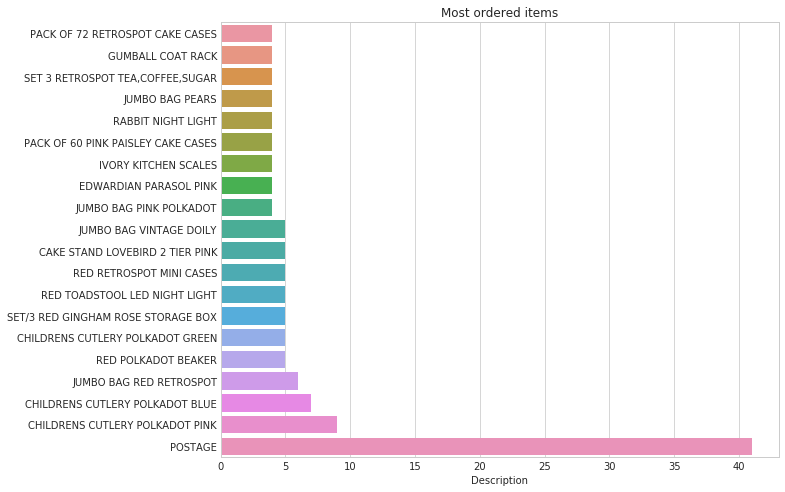
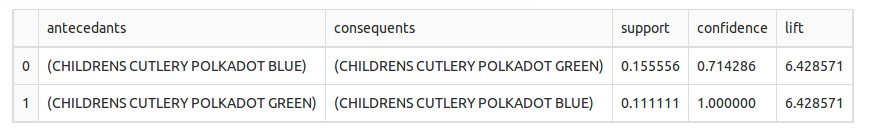

# Ostoskorianalyysi / assosiaatioanalyysi (Market basket analysis)
[marketbasket_apriori.ipynb](marketbasket_apriori.ipynb) tutorial in english    

Ostoskorianalyysissä pyritään löytämään yhden ostoskäynnin aikana ostetuista tuotteista usein yhdessä ostettavat tuotteet.
Notebookissa [marketbasket_apriori](marketbasket_apriori.ipynb) käsitellään ostosdataa, joka on saatavilla osoitteesta [http://archive.ics.uci.edu/ml/datasets/Online+Retail
](http://archive.ics.uci.edu/ml/datasets/Online+Retail). 

Ostosdatasta etsitään assosiaatiot käyttäen sekä [MLxtend](http://rasbt.github.io/mlxtend/), 
että [Apyori](https://pypi.python.org/pypi/apyori/1.1.1) -kirjastoja.

Alla olevassa taulukossa näkyy analyysissä löydetyt 10% tukiarvon ylittävät datajoukot. Luotettavuusarvo ensimmäisellä datajoukolla on 0,71 ja nostearvo
6,43. Eli jos ostoskori sisältää _edeltävän_ (antecedant) -tuotteen, niin 71%:n todennäköisyydellä myös _täydentävä_ (consequent) -tuote on valittu 
ostoskoriin. Tätä voitaisiin hyödyntää siten, että asiakkaan valitessa kyseisen _edeltävän_ tuotteen ostoskoriin, tarjottaisiin myös _täydentävää_
tuotetta, esimerkiksi "tämän ostaneet ostivat myös näitä:" -osiossa.

## Teoriaa

### Apriori

Usein  esiintyvien  tapahtumajoukkojen  louhintaan  ja  assosiaatiosääntöjen muodostukseen kehitetty algoritmi. 
 
 Pääperiaate: 
         * tapahtumajoukko usein esiintyvä -> osajoukot usein  esiintyviä
         * jos tapahtumajoukko on harvinainen -> ylijoukot harvinaisia 
         

Vaiheet:

- Rajataan, kuinka monen alkion joukkoja etsitään.
- Etsitään alkiojoukot, jotka ylittävät annetun _tukiarvon(support)_ ( = kattava joukko / frequent itemset). 
- Käytetään edellisen vaiheen muodostamaa kattavaa joukkoa assosiaatiosääntöjen erottamiseen (=vahvat säännöt).

---

* **support** - Tuki. Transaktiot, joissa alkiojoukko esiintyy, jaettuna transaktioiden kokonaismäärällä.

 
        supp(X) =  stddev(X u Y) / N    (u = union, elements in X or Y)     
     

* **confidence** - Luotettavuus. Jos ostoskori sisältää _edeltävän_ tuotteen, kuinka todennäköisesti se sisältää myös _täydentävän_ tuotteen.

 Korkea luotettavuus -> Y esiintyy todennäköisemmin transaktioissa, joissa X
 
                        supp(X u Y)
        conf(X-->Y) =  ________________     
                         supp(X)
                     

* **lift** - Nosto. Jos ostoskorissa _edeltävä_ tuote, kuinka paljon suuremmalla todennäköisyydellä ostetaan _täydentävä_ tuote. Hyvä käyttää sääntöjen luomisessa, jos ostoskorit jo rajattu sisältämään _täydentävän_ tuotteen.

  
        lift(X-->Y) = supp(XuY)/supp(X)*supp(Y)   
     
        (if Y>lift, Y likely to be bought with X)
 

---

### Assosiaatiosäännöt (association rules)

Assosiaatiosäännöt ilmaisevat korrelaatiota. 

"The Apriori algorithm calculates rules that express probabilistic relationships between items in frequent itemsets For example, a rule derived from frequent itemsets containing A, B, and C might state that if A and B are included in a transaction, then C is likely to also be included." -[Oracle Datamining, Apriori](https://docs.oracle.com/cd/B28359_01/datamine.111/b28129/algo_apriori.htm#DMCON061)

Tulosten tulkitseminen: 

    Antecedent (edeltävä) = JOS 

    Consequent (täydentävä) = NIIN...

    Suuri luotettavuusarvo -> jos ostoskorissa x, todennäköisesti myös y
    Suuri tukiarvo -> esiintyminen transaktioissa on suuri
    Nostearvo -> edellisten suhde

---

 
Lähteet: 
                                        
[Huttunen Sami, 2015. Http://epublications.uef.fi/pub/urn_nbn_fi_uef-20160089/urn_nbn_fi_uef-20160089.pdf](Http://epublications.uef.fi/pub/urn_nbn_fi_uef-20160089/urn_nbn_fi_uef-20160089.pdf)
 
[Räsänen Antti, 2015. Https://www.theseus.fi/bitstream/handle/10024/86733/Rasanen_Antti.pdf?sequence=1
](Https://www.theseus.fi/bitstream/handle/10024/86733/Rasanen_Antti.pdf?sequence=1)

[Arduino Startups. Https://www.youtube.com/watch?v=WGlMlS_Yydk](Https://www.youtube.com/watch?v=WGlMlS_Yydk)

---

keywords: market basket analysis, mlxtend, apyori, apriori
