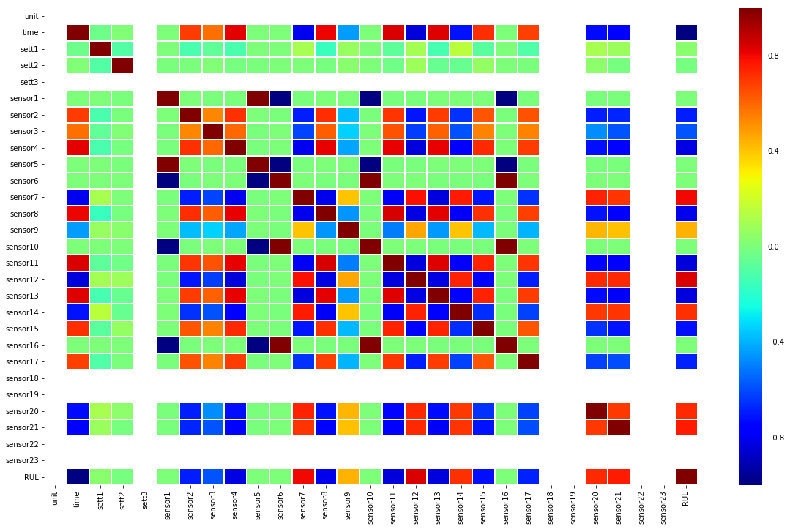
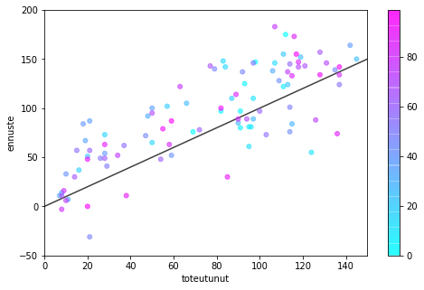
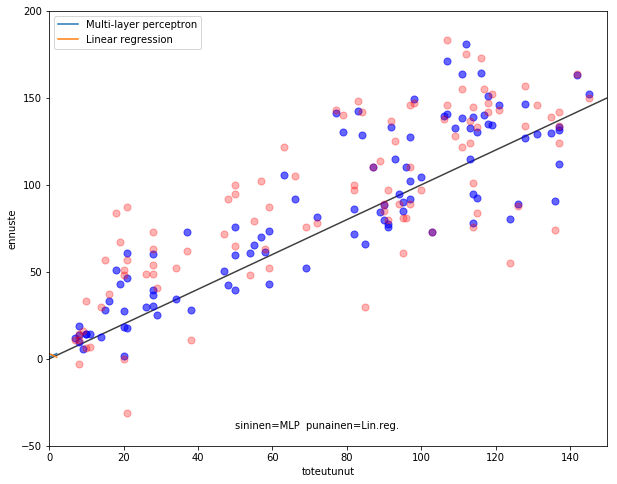

## NASA moottoridata

### Johdanto

Moottorien jäljellä olevan eliniän (remaining useful life, RUL) ennustaminen NASAn testidatasta.

Ennuste tehty ensin scikit learnin lineaarisella regressiolla, ja sen jälkeen multi-layer perceptronilla.

Mlp:n tulos oli samalla datalla parempi kuin lineaarisella regressiolla, mutta parani vielä merkittävästi, kun data skaalattiin StandardScaler -metodilla ennen ennustetta.

* Training data:     aircraft engine run-to-failure data.

* Testing data:      aircraft engine operating data without failure events recorded.

* Ground truth data: information of true remaining cycles for each engine in the testing data

Data source:  
["A. Saxena and K. Goebel (2008). "Turbofan Engine Degradation Simulation Data Set", 
NASA Ames Prognostics Data Repository, NASA Ames, Moffett Field, CA."]
(https://c3.nasa.gov/dashlink/resources/139/)

### Esikäsittely

1. Aluksi ladattiin training-datasetti tiedostosta train_FD001.txt, joka sisältää moottorien numerot, aikayksiköt, toiminta-asetukset ja 21:n sensorin lukemat kutakin aikayksikkö kohti. 

2. Training-datafreimiin lisättiin sarake, johon laskettiin kunkin moottorin jäljellä oleva elinikä aikayksikköä kohti (RUL).

3. Seuraavaksi tutkittiin anturien ja eliniän korrelaatiota heatmapillä ja pudotettiin pois sarakkeet, joissa ei havaittu juurikaan korrelaatiota.

### Lineaarinen regressio

Valittujen anturien perusteella tehtiin ennuste sklearn-kirjaston lineaarisella regressiolla. Inputtina anturidata, targettina RUL eli jäljellä olevan elinajan ennuste.
Ennusteessa käytettiin test_FD001.txt -dataa. Ennuste yhdistettiin uudeksi sarakkeeksi testidataan, ja haettiin datafreimistä kunkin moottorin kohdalta viimeisin ennuste. Lopuksi 
tulostettiin kaavio, jossa x-akselilla RUL_FD001.txt -tiedostosta haettu todellinen elinaika ja y-akselilla ennuste. Mitä lähempänä regressiosuoraa piste on, sitä parempi ennuste.

### Neuroverkko

Toinen ennuste laadittiin sklearnin multi-layer perceptron -neuroverkolla (MLPRegressor). Paremman tuloksen saamiseksi training-data skaalattiin sklearnin StandardScalerilla. 
Myös testidata skaalattiin, mutta koska datafreimin muoto on oltava sama, kun käytetään samaa skaalainta, testidataan lisättiin väliaikaisesti ylimääräinen time-sarake.
MLP:n inputtina käytettiin 'time'-saraketta ja valittuja antureita, targettina aiemmin luotua 'RUL'-saraketta. Paras tulos saavutettiin seuraavilla MLPRegressorin asetuksilla:

> max_iter = 100    
> layers = (50,50)  
> alphas = 0.2  
> init = 0.1    
    
> mlp = MLPRegressor(verbose=0, random_state=0, max_iter=max_iter, batch_size='auto', activation='relu',    
>                  learning_rate_init=init, solver='adam', alpha=alphas, hidden_layer_sizes=layers )

* 'verbose' : tulostetaanko stdout:iin vai ei

* 'random_state' : satunnaislukugeneraattorin alustus

* 'max_iter' : adam:ia ja sgd:tä käytettäessä tämä määrittää, kuinka monta kertaa kutakin datapointtia käytetään, muilla solvereilla tämä on iteraatioiden määrä

* 'batch_size' : skotastisten optimoijien minisatsin koko

* 'activation' : aktivointifunktiona 'relu', rectified linear unit

* 'learning_rate_init' : toimii vain adam:illa ja sgd:llä. Askelkoko painojen päivityksessä

* 'solver' : käytetty adam:ia, joka on stokastinen gradienttiin (kaltevuuskulmaan) perustuva optimoija

* 'alpha' : painojen pienentäminen L2-säännöstelyllä

* 'hidden_layer_sizes' : input- ja outputkerrosten välissä olevien piilokerrosten määrä

        
        

Ennustedata skaalataan takaisin inverse_transformilla:

> final_result = pd.DataFrame(sc.inverse_transform(results_mlp[feat]))

Lopulliseen kaavioon on piirretty lineaarisen regression ennuste ja neuroverkko-ennuste y-akselille, ja toteutuma x-akselille:

> keywords: sklearn, linear regression, scaling, neural networks, multi-layer perceptron

